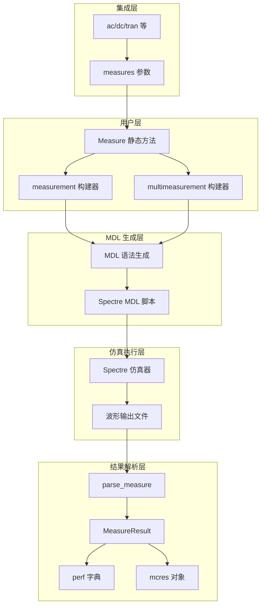
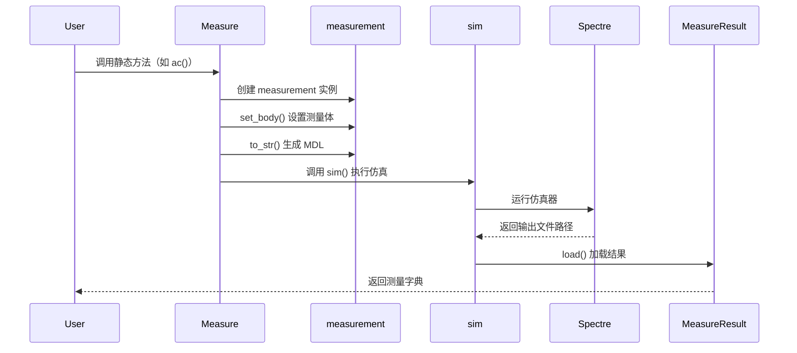
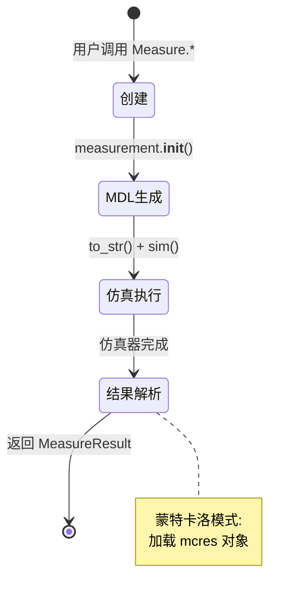

# 第 6 章：Automated Measurement（Measure）

## 1. 定义与动机

### 1.1 解决的问题

Automated Measurement（自动测量）系统是 `ted_simtype` 项目中的“智能尺”抽象，主要用于解决电路仿真后需要**手动分析波形/结果**的问题。系统通过以下方式解决这些问题：

1. **自动化指标提取**：直接从仿真结果中计算标准电路性能指标（延迟、上升时间、增益、ENOB 等）
2. **标准化测量方法**：封装工业标准的测量算法，确保测量结果的一致性
3. **多仿真器支持**：统一了 Spectre（MDL）和 HSPICE（`.meas`）的测量语法
4. **蒙特卡洛与 PVT 支持**：自动处理多次仿真运行的结果聚合

### 1.2 系统位置

在仿真流程里，自动测量系统位于 **“仿真执行后、结果分析前”**：

```
[电路网表] -> [仿真器] -> [波形数据] -> [Measure 系统] -> [性能指标]
                         ^          测量表达式定义
```

**上游依赖：**
- 仿真执行器（`sim` 函数）
- 波形数据文件（`.raw/.psf` 文件）
- 电路拓扑信息

**下游输出：**
- 性能指标字典（`Dict[str, TorchVariable]`）
- 蒙特卡洛统计结果（`MCresult`）
- 测试报告数据

### 1.3 非目标

自动测量系统**不处理**以下内容：

- 波形可视化（由 `Waveform` 类处理）
- 自定义信号处理算法（非标准测量需求）
- 仿真优化与参数扫描（由 `AnalysisLite` 处理）
- 测试基准管理（由 `@testbench` 装饰器处理）

---

## 2. 设计与原则

### 2.1 核心设计原则

1. **“测量与仿真分离”**：测量定义通过 `measures` 参数传递，与仿真命令解耦  
2. **“表达式驱动”**：使用仿真器原生表达式语言，保证测量精度  
3. **“结果自动解析”**：从输出文件中自动提取测量结果，无需手动处理  
4. **“类型安全”**：返回 `TorchVariable` 类型，与项目自然计算链条无缝集成  

### 2.2 关键数据结构

#### MeasureResult

```python
class MeasureResult:
    perf: Dict[str, TorchVariable]  # 指标结果
    mcres: MCresult                 # 蒙特卡洛结果
```

**不变式：**
- `perf` 字典的键是测量名称，值是对应的测量结果
- 对于扫描分析，单个键可能对应多个值（列表形式）
- `mcres` 仅在蒙特卡洛仿真时存在

**语义：**
- 键：测量名称（来自 `testname` 和 `measure` 的键）
- 值：对应的测量结果（`TorchVariable` 标量）
- 确定性：相同电路和参数下结果可重复
- 字段稳定性：键名保持不变，值为浮点数

#### measurement

```python
class measurement:
    title: str   # 测量标题
    body: str    # MDL 测量体
    rcmd: str    # 运行命令
```

**不变式：**
- `body` 必须是有效的 Spectre MDL 语法
- `rcmd` 必须包含 `run` 语句
- 生成的 MDL 必须通过仿真器语法检查

### 2.3 并发与线程安全

- **非线程安全**：`Measure` 类的方法是静态方法，依赖全局环境变量（`getenv`）
- **可重入性**：每次调用创建独立的 `measurement` 实例，无共享状态
- **多进程支持**：通过 `DataSweep` 支持多进程并行测量

### 2.4 性能模型

**时间复杂度：**
- 测量生成：`O(n)`，`n` 为测量数量
- 结果解析：`O(m)`，`m` 为输出文件行数

**关键路径：**
1. MDL 生成（毫秒级）
2. 仿真执行（秒到小时级，取决于电路规模）
3. 结果解析（毫秒级）

**内存考量：**
- 测量结果保存在 `perf` 字典中
- 大型扫描分析可能产生数万个数据点
- 建议使用 `mc_keys` 参数仅提取需要的测量项

---

## 3. 架构概览

### 3.1 系统架构



### 3.2 控制流与数据流

**正常流程：**



**错误传播（示例）：**
1. **测量语法错误**：仿真器报错，`sim()` 抛出异常，用户捕获  
2. **信号不存在**：测量结果为 `NaN`，`parse_measure()` 转换为 `0`  
3. **仿真失败**：输出文件为空，`load()` 抛出异常  

### 3.3 生命周期



---

## 4. API 参考（专业级）

### 4.1 API：`Measure.ac(input, output, testname, start, stop, measure)`（签名）

- **源文件**：`/home/wuqingsen/ted/ted_simtype/src/spectremeasure.py#608`
- **意图**：执行交流小信号分析并自动提取标准放大器性能指标（增益、带宽、相位裕度等）

#### 工作原理（原则）

1. **MDL 生成**：创建 `measurement` 实例，生成包含 `run ac` 与 `export` 语句的 MDL 脚本  
2. **测量表达式**：使用 Spectre 内置函数（`phasemargin`、`gainBwProd`、`bw` 等）计算指标  
3. **结果提取**：仿真完成后，从输出文件中解析 `export` 变量的值  
4. **特殊处理**：相位裕度测量包含相位校正逻辑（处理 `>170°` 的情况）  

#### 典型使用场景

- **运算放大器表征**：提取增益、GBW、PM、BW 等标准指标  
- **频率响应分析**：测量特定频率点的增益值  
- **自定义频域指标**：通过 `measure` 参数添加用户定义的测量  

#### 参数

| 参数名 | 类型 | 必需 | 默认值 | 约束条件 | 备注 |
|---|---|---:|---|---|---|
| `input` | `str` | 否 | `None` | 必须是电路中存在的节点名 | 输入信号节点（目前仅用于文档） |
| `output` | `str` | 否 | `None` | 必须是电路中存在的节点名 | 输出信号节点，用于生成测量表达式 |
| `testname` | `list` | 否 | `["gain","gbw","pm","bw","ugb","maxgain","gain1K","gain1M"]` | 必须是预定义指标名称的子集 | 要测的指标集合 |
| `start` | `float` | 否 | `0.01` | `> 0` | 频域扫描起始点（Hz） |
| `stop` | `float` | 否 | `10e9` | `> start` | 频域扫描结束点（Hz） |
| `measure` | `dict` | 否 | `{}` | 值必须是有效的 Spectre 表达式 | 自定义测量表达式字典 |

**预定义指标说明：**
- `gain`：低频增益（在 `start` 频率点）
- `gbw`：增益带宽积
- `pm`：相位裕度（Phase Margin）
- `bw`：-3dB 带宽
- `ugb`：单位增益带宽（0dB 交叉频率）
- `maxgain`：最大增益值
- `gain1K`：1kHz 处的增益
- `gain1M`：1MHz 处的增益

---

## 5. 错误与异常

### 5.1 错误类型与建议处理策略

| 错误类型 | 触发条件 | 推荐处理策略 |
|---|---|---|
| `Exception` | 仿真输出文件为空 | 检查 `testbench` 连接和仿真器日志 |
| `KeyError` | 请求不存在的指标 | 确保 `testname` 中的名称在预定义列表中 |
| `SyntaxError` | `measure` 表达式语法错误 | 验证 Spectre 表达式语法 |

---

## 6. 副作用 / 可观测性 / 安全性

### 6.1 副作用

- **I/O**：读取仿真输出文件，写入 MDL 脚本
- **状态变更**：修改全局环境的仿真器设置（通过 `setenv(simulator="spectremdl")`）
- **日志记录**：由底层 `sim()` 函数处理

### 6.2 可观测性

- **日志**：通过 `ted_utils.src.common.debug()` 输出调试信息
- **关联 ID**：使用电路模块名和测量标题
- **调试开关**：设置环境变量 `DEBUG=1` 启用详细日志

### 6.3 复杂性与性能说明

- **时间复杂度**：`O(n)`（`n` 为 `testname` 长度 + `measure` 字典大小）
- **空间复杂度**：`O(m)`（`m` 为频率扫描点数，由仿真器控制）
- **性能告警**：高频率扫描（`>10GHz`）可能显著增加仿真时间

### 6.4 安全 / 安全性考虑

- **输入验证**：节点名和表达式直接传递给仿真器，需确保来源可信
- **资源限制**：无内置限制，依赖仿真器配置
- **注入风险**：`measure` 参数支持任意表达式，应避免处理用户输入

---

## 7. 示例

### 示例 1：最小正确用法（节选）

```python
from pyted import *
from ted_device import *
from ted_simtype.spectremeasure import Measure

@module
def opamp(VINP, VINN, VOUT: Output):
    # 简化的运算放大器电路
    Vdd() >> (m1 := PMOS(l=0.5u, w=10u)) >> VOUT
    Vss() >> (m2 := NMOS(l=0.5u, w=5u))  >> VOUT
    VINP >> m1.gate
    VINN >> m2.gate

@testbench
def ac_testbench():
    VINP, VINN = Node(2)
    dut = opamp(VINP, VINN)

    V(Vdd(), Vss(), dc=1.2)
    V(VINP, 0, dc=0.6)  # 共模电压
    V(VINN, 0, ac=1)    # AC 信号源
```

### 示例 2：综合 AC 表征（含扫参 / 自定义测量 / 结果遍历）（节选）

```python
import numpy as np

@module
def differential_amp(vinp, vinn, vout: Output, l1=0.5u, w1=10u):
    '''差分放大器，支持参数扫描'''
    u = 1e-6
    vtail = Node()

    Vdd() >> (mp1 := PMOS(l=l1, w=w1, m=2)) >> vtail
    Vdd() >> (mp2 := PMOS(l=l1, w=w1, m=2)) >> vout
    (vinp, vout) >> PairedMosfet(l=l1, w=w1, m=4, mode="cross") >> vtail

    I(vtail, Vss(), dc=20e-6)
    C(vout, 0, c=2e-12)

@testbench
def comprehensive_ac_characterization():
    '''全面的 AC 性能表征'''
    vinp, vinn = Node(2)
    l = Variable(name="l", value=0.5)
    w = Variable(name="w", value=10)

    dut = differential_amp(vinp, vinn, l1=l, w1=w)

    # 设置数据扫描
    get_circuit().datasweep = DataSweep(
        "sweepdata",
        ["l", "w"],
        np.array([
            [0.5, 0.6, 0.7],   # 长度扫描点
            [10, 12, 14],      # 宽度扫描点
        ])
    )

    V(Vdd(), Vss(), dc=1.2, name="Vsupply")
    V(vinp, 0, dc=0.6)
    L(vout, 0, l=1e-12).rename("Lload")
    C(vout, 0, c=1e-12).rename("Cload")
    V(vinn, 0, ac=1).rename("vac")

    # 执行完整的 AC 测量
    results = Measure.ac(
        input="vinn",
        output="vout",
        testname=["gain", "gbw", "pm", "bw", "ugb", "maxgain"],
        start=1,
        stop=10e9,
        measure={
            # 自定义测量
            "gain_10k": "abs(V(vout)) @10KHz",
            "gain_100k": "abs(V(vout)) @100KHz",
            "phase_margin_deg": "phasemargin(sig=V(vout))",
            # 功耗测量（结合 DC 结果）
            "power_est": "abs(I(Vsupply)*V(VDD))",
        },
    )

    # 分析结果（示意）
    for corner_idx, corner_results in enumerate(results.items()):
        if isinstance(corner_results[1], list):
            debug(f"扫描点 {corner_idx}")
            for sweep_idx, value in enumerate(corner_results[1]):
                debug(f"  [{sweep_idx}] {corner_results[0]} = {value}")
```
