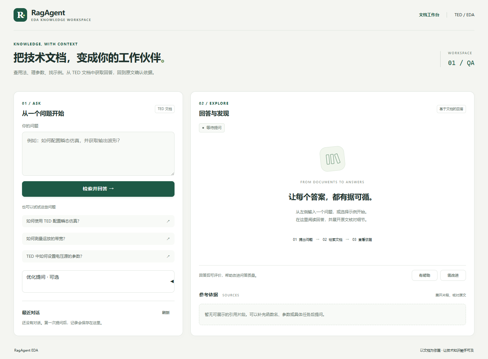
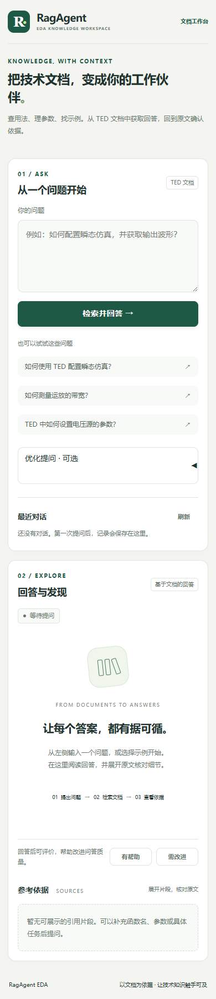

# 文档工作台使用指南

更新日期：2026-09-09。

## 启动与入口

在仓库根目录使用 Python 3.11 环境，复制 `.env.example` 为 `.env` 并填写自己的模型配置：

```bash
python -m pip install -r requirements.txt
python -m uvicorn backend.app:app --host 127.0.0.1 --port 8000
```

打开 `http://127.0.0.1:8000/ragagent/`。Swagger 位于 `/docs`，健康检查位于 `/health`。本次本机预览使用 `7861` 端口；它不是项目固定端口，新部署按实际启动参数访问。

首次建立知识库或修改 `Resource/` 后，可显式重建索引：

```bash
curl -X POST http://127.0.0.1:8000/v1/rag/reindex
```

重建会调用实际模型服务。`/health` 成功说明应用可以响应，不代表外部模型调用或答案质量已通过验证。

## 桌面工作区



左侧负责准备问题，右侧负责阅读回答和核对依据。初始页面的“等待提问”是界面状态，不是模型在线状态。

### 1. 直接提问

输入 TED 的函数、参数、配置或流程问题，也可以点击三个示例之一。示例只填入问题，点击“检索并回答”才会发起问答。工作台不会执行 `/v1/tasks/run` 的脚本任务。

### 2. 可选改写

展开“优化提问 · 可选”，选择保守型或激进型，点击“生成改写建议”。当前默认激进型。建议可以继续编辑，再通过“本次提问使用”选择原始问题或改写后的问题。

成功生成建议后会选中改写后的问题；精确问题可能保留原文，失败时会提示回退。编辑原始问题、切换改写模式或选择新示例，会清除旧建议并恢复原始问题来源。

### 3. 阅读回答与依据

| 界面状态 | 含义 |
| --- | --- |
| 等待提问 | 尚未提交本次问题 |
| 已生成回答 | 已获得问答结果，可继续核对引用 |
| 未找到相关依据 | 没有足够依据，可补充具体术语后重试 |
| 暂时无法回答 | 请求或服务出现问题，查看提示后重试 |

回答支持 Markdown、代码及表格。“参考依据”显示文档路径、相关度和原文片段；第一条默认展开，其余可以点击展开。相关度是检索 / 重排分数，不是正确率，也不保证处于 0–1 区间。

### 4. 评价与历史

“有帮助 / 需改进”分别保存为 `useful / useless`；可以修改评价，最后一次结果覆盖之前结果。“最近对话”最多读取当前浏览器标识下的 50 条记录，支持刷新和恢复原始问题、改写信息、回答及依据。

记录保存在服务端 SQLite（默认 `workdir/qa_feedback.db`，可通过 `RAG_QA_FEEDBACK_DB` 修改）。浏览器 `localStorage` 只保存 `ragagent_user_id` 标识。清除站点数据、使用无痕窗口或换浏览器后，原记录不会自动显示，但服务端数据仍然存在。这种筛选方式不等于身份认证或权限控制。

## 手机与键盘使用

宽度不超过 800px 时采用单栏；提问完成后自动滚动到回答区。控件提供键盘焦点样式，点击示例后仍可编辑问题。页面使用固定浅色配色，并尊重系统的减少动画偏好。

<details>
<summary>查看 390px 手机页面截图</summary>



</details>

## 维护与部署

| 文件 | 职责 |
| --- | --- |
| [gradio_ragagent.py](../backend/ui/gradio_ragagent.py) | 组件、示例、回调、历史和证据 HTML |
| [workbench.css](../backend/ui/workbench.css) | 配色、控件、响应式和动效 |
| [qa_agent.py](../backend/agents/qa_agent.py) | 文档问答和证据门控 |
| [query_rewriter.py](../backend/agents/query_rewriter.py) | 改写生成与校验 |
| [qa_feedback_store.py](../backend/storage/qa_feedback_store.py) | 问答及评价存储 |

`workbench.css` 在导入 UI 模块时读取，部署必须携带该文件，修改后需要重启服务。Gradio 4 会对部分 CSS 规则添加作用域，因此根容器使用 `clamp()` 设置流式边距。

`requirements.txt` 包含 Gradio 4.44.1 的 `huggingface-hub<1.0` 兼容约束；若遇到 `HfFolder` 导入错误，应先重新安装项目依赖并执行 `python -m pip check`。真实 `.env`、数据库、索引和临时预览数据不随仓库上传。

## 本轮验证记录

已在本地使用真实 Gradio 页面和独立模拟回答完成下列检查：

- 示例填入、改写生成与来源选择、旧建议清除。
- 回答、代码表格渲染、引用展开 / 收起、片段 HTML 转义。
- 评价保存、历史恢复、无结果与服务错误提示。
- 桌面和 390px 窄屏布局、键盘焦点、暗色系统偏好、减少动画偏好、窄屏回答自动定位。
- Python 编译、依赖一致性及 Git 补丁格式检查。

本轮未验证真实模型的检索质量、生成质量或 TED 仿真。这里的截图是应用初始页面，不含测试回答；验证所用临时脚本和数据库放在已忽略的 `workdir/`，不属于仓库提供的回归测试套件。

返回 [README](../README.md) 或阅读 [项目说明](../项目说明.md)。
